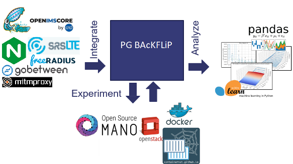

In the next generation of networks (you may know it as “5G”) many network components will be moved to the cloud to improve the flexibility and manageability of our networks. In this scenario, called network function virtualisation (NFV), virtualised network functions (VNFs), like firewalls or intrusion detection systems, which are installed in virtual machines or containers [Docker](https://www.docker.com) and can be deployed on-demand on cloud infrastructures, such as [OpenStack](https://www.openstack.org) or [Kubernets](https://kubernetes.io). These VNFs can then be connected (chained) to form more complex network services. This simplifies the development of novel network services, because deployments can be fully automated and be done in minutes instead of days, as required by legacy, hardware-based network functions.

### Milestones / Goals

* Identify and analyse candidate VNFs and network service projects to be benchmarked (e.g. [Open5GCore](https://www.open5gcore.org/), [OpenIMS](https://www.openimscore.com/), [Docker](https://www.docker.com/), etc.)
* Setup a benchmarking testbed and integrate it with existing NFV benchmarking solutions
* Design and run a first set of benchmarking experiments using the existing toolchain
* Integrate VNFs and network services to be executed and tested on the benchmarking testbed
* Extend and improve the [5GTANGO benchmarking tool](https://github.com/sonata-nfv/tng-sdk-benchmark) to be able work with one of the most prominent NFV MANO solutions in the telecom industry: [OpenSource MANO](https://osm.etsi.org/)
* Run a second set of benchmarking experiments using your extended toolchain
* Document all experiment setups and outcomes
* Analyse the outcomes and polish the data for publication

Vacay is a web application that I helped create as a team project in ICS 415, Spring 2015. The project helped me learn how to design and implement a responsive web site.

Vacay is implemented using [Meteor](http://meteor.com), a JavaScript application platform. Within two weeks, we created a website that implements several types of reservations including flights, hotels, and car rentals.

In this project I gained experience with full-stack web application design and associated technologies, including [MongoDB](http://mongodb.com) for database storage, the [Twitter Bootstrap](http://getbootstrap.com/) CSS Framework for the user interface, and Javascript for both client and server-side programming.

Source: <a href="https://github.com/theVacay/vacay"><i class="large github icon"></i>theVacay/vacay</a>
